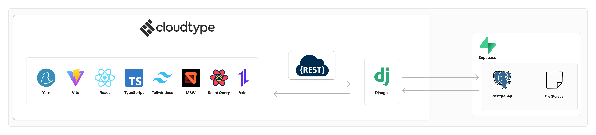

# 한국로보컵협회
사단법인 한국로보컵협회는 로봇을 연구하는 학생들을 위해 국가적 및 국제적 로봇 이벤트인 로보컵 리그를 주최하며, 프로젝트 중심의 교육을 증진하는 비영리 단체입니다.  

# 💻Developers
|PM & FE|BE|
|-|-|
|||
|[@jiuuoo](https://github.com/JIUUOO)|[@Hyuk-II](https://github.com/Hyuk-II)|
# 🛠️ System Architecture

# 📦 Backend Libraries
|라이브러리|버전|기능|
|-|-|-|
|Django|5.1.4|백엔드 개발을 위한 프레임워크|
|django-cors-headers|4.6.0|설정한 출처에서 오는 요청을 허용하는 라이브러리|
|django-environ|0.11.2|.env로 환경변수를 관리하기 위한 라이브러리|
|django-storage-supabase|0.1.0|프로젝트 내에서 Supabase 서비스의 사용을 위한 라이브러리|
|djangorestframework|3.15.2|REST 웹 api를 사용하기 위한 라이브러리|
|pillow|11.1.0|이미지 형식의 파일을 다루기 위한 라이브러리|
|postgrest-py|0.5.0|PostgreSQL 데이터 베이스 api를 사용하기 위한 라이브러리|
|psycopg2|2.9.10|PostgreSQL 데이터베이스와 상호 작용하기 위한 라이브러리|
|whitenoise|6.8.2|정적파일을 간편하게 사용하기 위한 라이브러리|

# 🎯 Commit Rules  
🎨 Style: 코드 형식 수정, 기능 변경이 없는 경우  
🔥 Remove: 코드 파일 제거  
🐛 Fix: 버그 수정  
✨ Feat: 새로운 기능 추가  
📝 Docs: 문서 수정  
💄 Design: 디자인 변경  
✅ Test: 테스트 코드  
♻️ Refactor: 코드 구조 재구성  
🔧 Chore: 빌드, 패키지 매니저 수정 등 기타 작업  
🚚 Rename: 리소스 이동, 이름 변경
