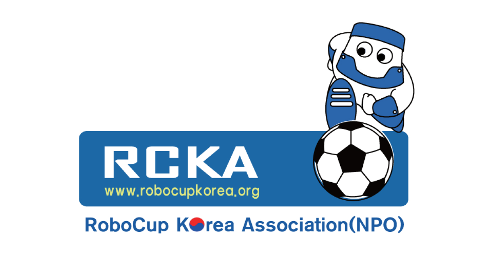

# 한국로보컵협회
사단법인 한국로보컵협회는 로봇을 연구하는 학생들을 위해 국가적 및 국제적 로봇 이벤트인 로보컵 리그를 주최하며, 프로젝트 중심의 교육을 증진하는 비영리 단체입니다.  

# 🎯 Commit Rules  
🎨 Style: 코드 형식 수정, 기능 변경이 없는 경우  
🔥 Remove: 코드 파일 제거  
🐛 Fix: 버그 수정  
✨ Feat: 새로운 기능 추가  
📝 Docs: 문서 수정  
💄 Design: 디자인 변경  
✅ Test: 테스트 코드  
♻️ Refactor: 코드 구조 재구성  
🔧 Chore: 빌드, 패키지 매니저 수정 등 기타 작업  
🚚 Rename: 리소스 이동, 이름 변경
